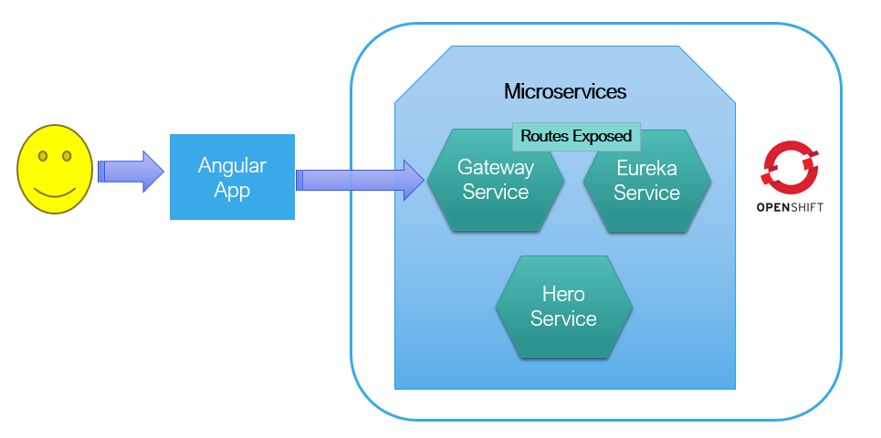
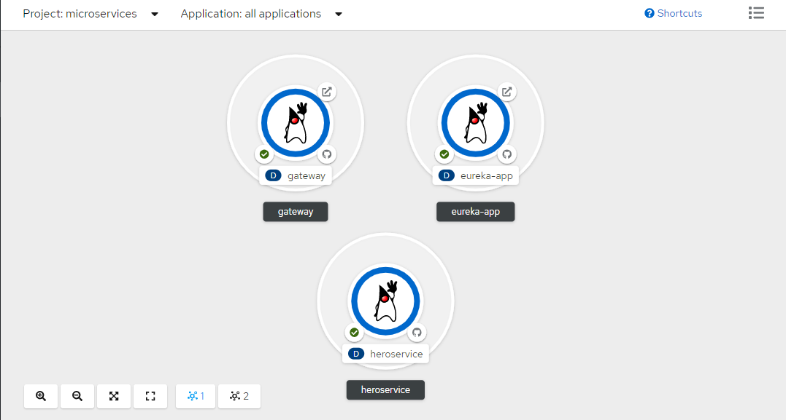

# angular-heroes
This is our famous angular heroes project, though the default one uses in memory services as backend, instead I have used spring based micro-services deployed in OpenShift.

## Architecture
Simple Architecture, Where We have Angular Web Application invokes spring based micro-services deployed in OpenShift. HeroService is the actual server that does not have any routes published, instead goes via Gateway and Eureka.



OpenShift services snapshot for your quick reference.



## Deployment
High level steps if you wanted to try:
```
Clone git repository
edit OpenShift gateway URL in hero.service.ts file i.e. **heroesUrl** property
npm install
ng build --prod
copy all the files from dist directory to tomcat ROOT or your web server root
```
You all set to test, Angular should pull the heros and show on the page.
